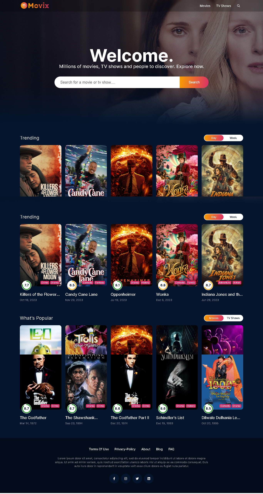

# MovieX

MovieX is a feature-rich web application built with React.js, Sass, Axios, and Redux, offering a delightful movie browsing experience.

## Features

- 🎬 Infinite scrolling for seamless movie exploration
- 🌟 Advanced functionalities powered by Redux state management
- 🖥️ Responsive design for optimal viewing on various devices
- 🎥 Detailed movie information fetched using Axios

## Getting Started

Follow these steps to run MovieX locally:

1. Clone the repository: `https://github.com/almaskhan1286/Movix.git`
2. Install dependencies: `npm install`
3. Start the development server: `npm start`

## Contributing

We welcome contributions! Feel free to submit issues or pull requests.

Enjoy exploring movies with MovieX! 🍿🎥

## 🔗 Social Links:

|  |  |
| --- | --- |